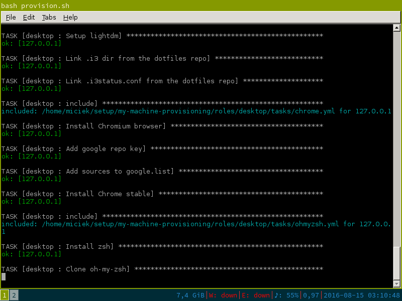

# devSetup
Automated Installation of a PC preconfigured with Tools for Development

Execute this command on the machine which you want to provision:

```
wget -qO- https://github.com/alexandermikuta/devSetup/raw/master/provision.sh | bash
```



## What's inside?
The playbook is divided into 2 roles: `desktop` and `development`.

`Desktop` role provisions all desktop user stuff, like:

- i3 window manager
- oh-my-zsh
- Source Code Pro font
- Chrome
- other useful tools

`Development` role provisions all programming-related stuff, like:

- Vim
- Atom,
- Docker,
- IntelliJ,
- Java,
- Scala
- Node.js

## Testing
The machine can be easily provisioned from scratch using Vagrant. Just make sure you have Vagrant installed and execute `vagrant up`. Then you can use the fresh system inside VirtualBox.

## Adding new tasks
Whenever I want to install something on my computer I add a task and tag all its steps as `debug`. Then I run it using

`ansible-playbook setup.yml -i hosts --connection=local --ask-sudo-pass --extra-vars "@config.json" --tags "debug"`

If everything works as planned, I remove tags and commit it to the repository.

## Inspiration and resources
This deployment was heavily inspired by: https://github.com/miciek/my-machine-provisioning

## License
MIT
